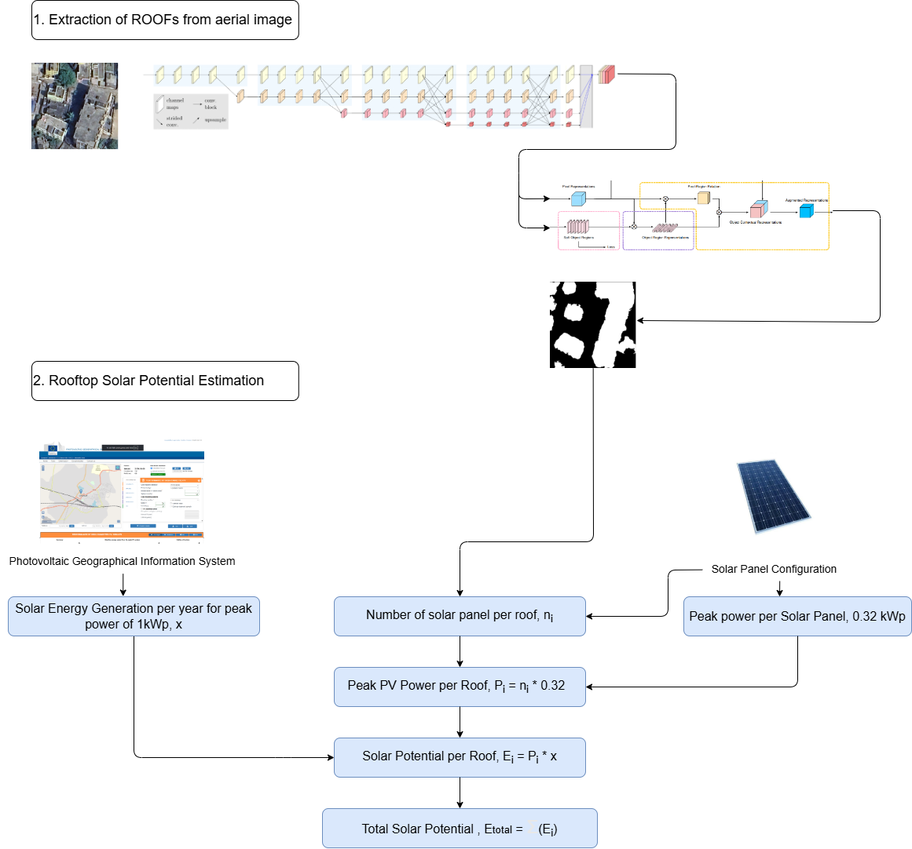

# Rooftop Solar Potential Estimation

An end-to-end deep learning pipeline for **automated rooftop segmentation** and **solar potential estimation** from high-resolution aerial imagery.



## Overview

This project presents a deep learning-based pipeline for rooftop solar potential estimation using high-resolution satellite imagery. It combines HRNet with OCR and boundary-aware modules for accurate rooftop segmentation, followed by post-processing and integration with PVGIS to estimate usable rooftop area and annual solar energy yield.

The framework is trained in two stages—using the RID dataset for generic feature learning and a custom Indian dataset for local adaptation—supporting city-scale analysis for sustainable urban planning.

## Key Features

- **Advanced Segmentation Architecture**: HRNet + OCR backbone with boundary refinement
- **Two-stage Training**: RID pretraining + Indian fine-tuning
- **Post-processing Pipeline**: CRF and edge filtering for improved accuracy
- **Solar Potential Estimation**: Usable area estimation in m² and solar energy yield via PVGIS
- **Comprehensive Visualization**: Tools for visualizing segmentation results and solar potential

## Project Structure

```
Solar_Potential_Estimation/
├── configs/              # Configuration files
├── dataloader/           # Data loading utilities
├── datasets/             # Dataset definitions
├── inference/            # Inference scripts
├── lib/                  # Core libraries
├── model/                # Model architecture definitions
├── model_images/         # Architecture diagrams
├── train_script/         # Training scripts
└── INFERENCE_GUIDE.md    # Detailed guide for running inference
```

## Getting Started

### Prerequisites

- Python 3.8+
- PyTorch 1.8+
- CUDA-compatible GPU (recommended)

### Installation

1. Clone this repository:
   ```bash
   git clone https://github.com/yourusername/rooftop-solar-potential.git
   cd rooftop-solar-potential
   ```

2. Create and activate a virtual environment:
   ```bash
   python -m venv .venv
   source .venv/bin/activate  # On Windows: .venv\Scripts\activate
   ```

3. Install required packages:
   ```bash
   pip install torch torchvision
   pip install yacs albumentations opencv-python matplotlib pandas pillow scikit-image
   pip install pytorch-msssim opencv-contrib-python requests
   pip install gdown  # For downloading datasets
   ```

### Downloading Pre-trained Weights

```bash
gdown --folder https://drive.google.com/drive/folders/1RmPxBfePZctk_RLSwMcZFcjqx4HxDiI7 -O Solar_Potential_Estimation/i_outputs
```

### Running Inference

For detailed instructions on running inference, please refer to the [Inference Guide](Solar_Potential_Estimation/INFERENCE_GUIDE.md).

Quick start:
```bash
# Run inference on a single image
python Solar_Potential_Estimation/inference/i_inference.py \
  --checkpoint Solar_Potential_Estimation/i_outputs/epoch_99.pth \
  --cfg Solar_Potential_Estimation/configs/inria_hrnet_ocr.yaml \
  --image Solar_Potential_Estimation/test_crowd/images/your_image.png \
  --output Solar_Potential_Estimation/test_crowd/pred
```

## Model Architecture

The model architecture combines HRNet (High-Resolution Network) with OCR (Object-Contextual Representations) for accurate rooftop segmentation:


## References

1. Wang et al., *Deep High-Resolution Representation Learning*, IEEE TPAMI, 2021.
2. Yuan et al., *Object-Contextual Representations*, ECCV, 2020.
3. Qingyu Li et al., *SolarNet: A convolutional neural network-based framework for rooftop solar potential estimation from aerial imagery Applied Energy*, 2024.
4. Qingyu Li et al., *Deep learning-based framework for city-scale rooftop solar potential estimation by considering roof superstructures. Applied Energy*, 2024.
5. Krapf, S. et al., *RID—Roof Information Dataset for Computer Vision-Based Photovoltaic Potential Assessment*, Remote Sens. 2022.

## License

This project is open-sourced under the MIT License. See the LICENSE file for details.

## Acknowledgements

- PVGIS API: [https://ec.europa.eu/jrc/en/pvgis](https://ec.europa.eu/jrc/en/pvgis)
- RID Dataset: [https://mediatum.ub.tum.de/1655470](https://mediatum.ub.tum.de/1655470) 